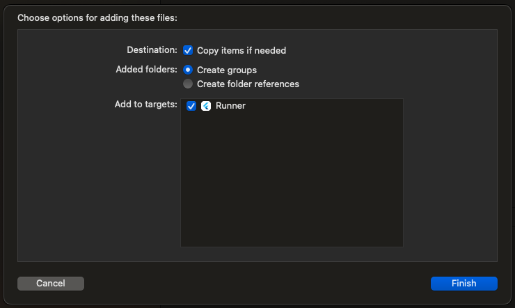

# flutter_au10tix_sample

A Flutter project that demonstrates how to integrate AU10TIX's Flutter SDK plugins, including Smart Document Capture (SDC), Passive Face Liveness (PFL), NFC Passport, Voice Consent (VC), Video Session (VS), and ID Thickness.

## Table of Contents

- [Compatibility](#compatibility)
  - [AU10TIX SDK](#au10tix-sdk)
  - [Flutter SDK](#flutter-sdk)
- [Project Setup](#project-setup)
  - [Prerequisite](#prerequisite)
  - [AU10TIX SDK Setup](#au10tix-sdk-setup)
  - [Permissions](#permissions)
- [Usage](#usage)
  - [Preparing the SDK](#preparing-the-sdk)
  - [UI Component Implementation](#ui-component-implementation)
    - [UI Configurations](#ui-configurations)
    - [Asset Management](#asset-management-ios-only)
  - [Custom UI Implementation](#custom-ui-implementation)
    - [Smart Document Capture (SDC) & Proof of Address (POA)](#smart-document-capture-sdc--proof-of-address-poa)
    - [Passive Face Liveness (PFL)](#passive-face-liveness-pfl)
      - [PFL Status Codes](#pfl-status-codes)
    - [Au10tixCameraView Usage](#au10tixcameraview-usage)
  - [NFC Passport](#nfc-passport)
  - [Voice Consent (VC)](#voice-consent-vc)
  - [Video Session (VS)](#video-session-vs)
  - [ID Thickness](#id-thickness)
  - [Suspicious Behavior Detection](#suspicious-behavior-detection)
  - [Front End Classification (FEC)](#front-end-classification-fec)
  - [Backend Integration](#backend-integration)
- [Support](#support)
  - [Contact](#contact)

## Compatibility

### AU10TIX SDK

The plugin is compatible with the following native AU10TIX SDK versions:

- Android: 4.7.0
- iOS: 4.7.0

### Flutter SDK

Tested with channel stable 3.16.5.

## Project Setup

### Prerequisite

Before getting started, make sure you are setup on GitHub with our native SDK and have all the necessary credentials. You can find the relevant documentation for that here:
[Click here for Android](https://documentation.au10tixservices.com/mobile-sdk/android/sdk-implementation-guide/introduction/#integrating-the-sdk-to-your-android-project).
[Click here for iOS](https://documentation.au10tixservices.com/mobile-sdk/ios/sdk-implementation-guide/introduction/#integrating-the-sdk-to-your-ios-project).

If you need assistance, please contact AU10TIX support.

### AU10TIX SDK Setup

1. Create a new Flutter project.
2. Open the `pubspec.yaml` file.
3. Add the AU10TIX plugin dependencies from pub.dev as needed:

   ```yaml
   dependencies:
     flutter:
       sdk: flutter
     sdk_core_flutter: ^4.7.2
     sdk_sdc_flutter: ^4.7.2
     sdk_pfl_flutter: ^4.7.2
     sdk_nfc_flutter: ^4.7.2
     sdk_vc_flutter: ^4.7.2
   ```

   - Core — <https://pub.dev/packages/sdk_core_flutter>
   - SDC — <https://pub.dev/packages/sdk_sdc_flutter>
   - PFL — <https://pub.dev/packages/sdk_pfl_flutter>
   - NFC — <https://pub.dev/packages/sdk_nfc_flutter>
   - VC/VS/IDThickness — <https://pub.dev/packages/sdk_vc_flutter>

4. Android:

   1. In the `android` folder, open the `local.properties` file.
   2. Add the following:

      ```gradle
      key=<your_au10tix_pat>
      ```

      resulting in this structure:
      ```gradle
      sdk.dir=
      flutter.sdk=
      key=
      flutter.buildMode=
      flutter.versionName=
      ```

      The AU10TIX Android SDK will use your PAT to implement the dependencies.

5. iOS:

   1. In the `iOS` folder, open the `podfile`.
   2. Make sure you set the `platform` as follows:

      ```ruby
      platform :ios, '13.0'
      ```

   3. Find the line `flutter_ios_podfile_setup` and add the sources below it:

      ```ruby
      flutter_ios_podfile_setup
      source 'https://github.com/CocoaPods/Specs.git'
      source 'https://github.com/au10tixmobile/iOS_Artifacts_cocoapods_spec.git'
      ```

   4. If using NFC with SDC scanner type, add the following pod inside the `Runner` target:

      ```ruby
      pod 'Au10tixSmartDocumentCaptureUI', '4.7.0'
      ```

   5. Save and run `pod install` in the terminal.

6. Run `flutter pub get`.

### Permissions

The AU10TIX SDK requires the following permissions depending on which features you use:

- Camera (SDC, PFL, NFC)
- Microphone (PFL, VC)
- NFC (NFC Passport — iOS only, configured automatically)

In this sample we use the `permission_handler` plugin: <https://pub.dev/packages/permission_handler>.

Follow the guide in the plugin to add the permissions above.

## Usage

### Preparing the SDK

1. Import the AU10TIX Core plugin:

   ```dart
   import 'package:sdk_core_flutter/sdk_core_flutter.dart';
   ```

2. Initialize the SDK:

   ```dart
   Au10tix.init(<workflowResponse>);
   ```

   The workflow response object is the response you get when making a workflow request with Au10tix, for instance Au10tix101. Documentation on Authentication with Au10tix can be found [here](https://documentation.au10tixservices.com/getting-started/authentication/).

3. Use the `init` method asynchronously with `await`, surrounded by try/catch. If you receive a `PlatformException` in the catch it means the preparation of the SDK has failed. In either case you can parse the message like this:

   ```dart
   result['init']
   ```

### UI Component Implementation

To start the built-in UI components for SDC, POA, and PFL:

```dart
// PFL
final result = await SdkPflFlutter.startPFLUI();

// SDC
final result = await SdkSdcFlutter.startSDCUI();
// optional: isFrontSide: false for backside

// POA
final result = await SdkSdcFlutter.startPOAUI();
```

The result will arrive after the user clicks approve.

```dart
final featureName = 'sdc'; // or 'pfl', 'poa'
final status = result[featureName]['status'];
final imagePath = result[featureName]['imagePath'];
final croppedImagePath = result[featureName]['croppedFilePath'];
```

#### UI Configurations

For each of the start methods above you can pass a `uiConfig` parameter:

```dart
UIConfig uiConfig = UIConfig(
    showIntroScreen: true,   // show/hide the intro screen
    showCloseButton: true,   // show/hide the close button
    showPrimaryButton: true, // show/hide the capture button
    canUpload: true);        // show/hide the upload option button

final result = await SdkSdcFlutter.startSDCUI(uiConfig: uiConfig);
```

The default value for all fields is `true`.

#### Asset Management (iOS only)

The default configuration for asset loading in iOS is from the server — assets (including fonts) are downloaded when the SDK is prepared. To bundle them with the app instead:

1. Request the iOS Assets Catalog from Support.
2. Remove any unused `.xcassets` folders.
3. Open your project workspace in Xcode.
4. Drag the Assets folder to the Runner folder.
5. Check the following boxes:
   
6. Open `AppDelegate.swift` and add:

```swift
import Au10tixCore
...
Au10tix.shared.assetsManagerConfigurations.assetsSource = .bundle(.main)
```

See the full code here: [AppDelegate.swift](https://github.com/au10tixmobile/flutter_au10tix_sample/blob/main/ios/Runner/AppDelegate.swift)

Read more about iOS asset management in the [iOS documentation](https://documentation.au10tixservices.com/mobile-sdk/ios/sdk-implementation-guide/ui-comps/overview/#ui-assets).

### Custom UI Implementation

#### Smart Document Capture (SDC) & Proof of Address (POA)

1. Import the SDC plugin:

   ```dart
   import 'package:sdk_sdc_flutter/sdk_sdc_flutter.dart';
   ```

2. Add the `Au10tixCameraView` widget with `viewType` set to `"au10tixCameraViewSDC"`. Read more [here](#au10tixcameraview-usage).

3. Start the feature:

   ```dart
   // SDC
   final result = await SdkSdcFlutter.startSDC();
   // Add isFrontSide: false for backside

   // POA
   final result = await SdkSdcFlutter.startPOA();
   ```

   The result contains `status`, `imagePath`, and `croppedFilePath`:

   | Status | Description            |
   | ------ | ---------------------- |
   | 0      | Bad Image Quality      |
   | 1      | Hold Steady            |
   | 2      | No ID Detected         |
   | 3      | Image Too Far          |
   | 4      | Image Too Close        |
   | 5      | Image Outside of Frame |

4. To receive live frame updates:

   ```dart
   StreamBuilder<String>(
     stream: SdkSdcFlutter.streamSdkUpdates()
         .map((event) => SdkSdcFlutter.getSDCTextUpdates(event)),
     builder: (context, snapshot) { ... },
   )
   ```

5. Stop the session:

   ```dart
   SdkSdcFlutter.stopSession();
   ```

6. Capture manually:

   ```dart
   SdkSdcFlutter.onCaptureClicked();               // SDC
   SdkSdcFlutter.onCaptureClicked(isPOA: true);    // POA
   ```

7. Upload from gallery:

   ```dart
   SdkSdcFlutter.onUploadClicked();
   ```

#### Passive Face Liveness (PFL)

1. Import the PFL plugin:

   ```dart
   import 'package:sdk_pfl_flutter/sdk_pfl_flutter.dart';
   ```

2. Add the `Au10tixCameraView` widget with `viewType` set to `"au10tixCameraViewPFL"`. Read more [here](#au10tixcameraview-usage).

3. Start the feature:

   ```dart
   final result = await SdkPflFlutter.startPFL(
     isF2F: false,             // enable Face-to-Face comparison mode
     enableMicrophone: true,   // enable microphone during session
   );
   ```

4. The result contains `status`, `imagePath`, and `croppedFilePath`. Status `1` means a face was detected successfully. To send the image for a liveness check:

   ```dart
   final livenessResult = await SdkPflFlutter.validateLiveness();
   ```

5. Liveness result keys:

   | Key     | Values                                      |
   | ------- | ------------------------------------------- |
   | status  | 0 (failed) or 1 (passed)                    |
   | details | "Liveness failed" or "Liveness Passed"      |
   | result  | JSON with `probability`, `quality`, `score` |

6. Live updates stream:

   ```dart
   StreamBuilder<String>(
     stream: SdkPflFlutter.streamPFLUpdates()
         .map((event) => SdkPflFlutter.getPFLTextUpdates(event)),
     builder: (context, snapshot) { ... },
   )
   ```

7. Stop the session:

   ```dart
   SdkPflFlutter.stopSession();
   ```

8. Capture manually:

   ```dart
   SdkPflFlutter.onCaptureClicked();
   ```

##### PFL Status Codes

```dart
static const int RECORDING_STARTED = 9;
static const int USER_INTERRUPTED = 12;
static const int RECORDING_ENDED = 13;
static const int HOLD_STEADY = 200;
static const int ERROR_INTERNAL = 300;
static const int ERROR_HOLD_DEVICE_STRAIGHT = 301;
static const int ERROR_NO_FACE_DETECTED = 302;
static const int ERROR_MULTIPLE_FACES_DETECTED = 303;
static const int ERROR_FACE_TOO_FAR = 304;
static const int ERROR_FACE_TOO_CLOSE = 305;
static const int ERROR_HOLD_DEVICE_STEADY = 306;
static const int ERROR_FAILED_ALL_RETRIES = 307;
static const int ERROR_FACE_TOO_CLOSE_TO_BORDER = 309;
static const int ERROR_FACE_TOO_CLOSE_TO_RIGHT = 310;
static const int ERROR_FACE_TOO_CLOSE_TO_LEFT = 311;
static const int ERROR_FACE_TOO_CLOSE_TO_TOP = 312;
static const int ERROR_FACE_TOO_CLOSE_TO_BOTTOM = 313;
static const int ERROR_FACE_CROPPED = 314;
static const int ERROR_FACE_ANGLE_TOO_LARGE = 315;
static const int ERROR_FACE_IS_OCCLUDED = 316;
static const int ERROR_FAILED_TO_READ_IMAGE = 317;
static const int ERROR_FAILED_TO_WRITE_IMAGE = 318;
static const int ERROR_FAILED_TO_READ_MODEL = 319;
static const int ERROR_FAILED_TO_ALLOCATE = 320;
static const int ERROR_INVALID_CONFIG = 321;
static const int ERROR_NO_SUCH_OBJECT_IN_BUILD = 322;
static const int ERROR_FAILED_TO_PREPROCESS_IMAGE_WHILE_PREDICT = 323;
static const int ERROR_FAILED_TO_PREPROCESS_IMAGE_WHILE_DETECT = 324;
static const int ERROR_FAILED_TO_PREDICT_LANDMARKS = 325;
static const int ERROR_INVALID_FUSE_MODE = 326;
static const int ERROR_NULLPTR = 327;
static const int ERROR_LICENSE_ERROR = 328;
static const int ERROR_INVALID_META = 329;
static const int ERROR_UNKNOWN = 330;
```

#### Au10tixCameraView Usage

1. Import the widget:

   ```dart
   import 'package:sdk_core_flutter/camera_view.dart';
   ```

2. Add the widget:

   ```dart
   Au10tixCameraView(
     featureHandlerFn: <fn>,
     viewType: <viewTypeString>,
   )
   ```

   Required parameters:
   - `featureHandlerFn` — called when the view is ready; use this to start the feature.
   - `viewType` — `"au10tixCameraViewSDC"` for SDC/POA, `"au10tixCameraViewPFL"` for PFL.

   Optional parameters:
   - `width` & `height` — defaults fill 3/4 of the screen.
   - `withOverlay` & `overlayColor` — overlay shown until frames appear (workaround for an Android camera flash effect).

### NFC Passport

Import the NFC plugin:

```dart
import 'package:sdk_nfc_flutter/sdk_nfc_flutter.dart';
```

Start the NFC UI (handles MRZ scanning, NFC chip reading, and result display):

```dart
final result = await SdkNfcFlutter.startUI(
  isID: false,                       // true for ID card, false for passport
  scannerType: NFCScannerType.mrz,   // or NFCScannerType.sdc
  uiConfig: uiConfig,                // optional
);
```

Check NFC availability before starting:

```dart
final available = await SdkNfcFlutter.isNfcAvailable();
```

The result contains passport data including name, date of birth, document number, and photo.

### Voice Consent (VC)

Import the VC plugin:

```dart
import 'package:sdk_vc_flutter/sdk_vc_flutter.dart';
```

Start the Voice Consent UI:

```dart
final result = await SdkVcFlutter.startVCUI(
  vcSessionTime: 20.0,              // recording duration in seconds (5–30, default 20)
  consentText: 'I agree...',        // optional consent text to display
  showConsent: true,                // show consent screen before recording
);
```

The result contains a `videoPath` to the recorded file:

```dart
final videoPath = result['vc']['videoPath'];
```

### Video Session (VS)

```dart
final result = await SdkVcFlutter.startVideoSession(
  consentText: 'I consent...',      // optional
  showConsent: true,                // show consent screen before recording
  selfieDuration: 7.0,             // selfie recording duration in seconds (4–30, default 7)
  idDuration: 5.0,                  // ID recording duration in seconds (4–30, default 5)
);
```

### ID Thickness

```dart
final result = await SdkVcFlutter.startIDThickness(
  consentText: 'I consent...',      // optional
  showConsent: true,
  frontDuration: 8.0,              // front capture duration in seconds (1–15, default 8)
  backDuration: 8.0,               // back capture duration in seconds (1–15, default 8)
  tiltedDuration: 8.0,             // tilted capture duration in seconds (1–15, default 8)
  instructionsDuration: 3.0,       // instructions screen duration in seconds (1–6, default 3)
);
```

### Suspicious Behavior Detection

Suspicious behavior detection can be enabled for PFL and SDC sessions. Pass a `SuspiciousBehaviorConfig` to enable it with default settings, or `null` to disable it:

```dart
import 'package:sdk_core_flutter/sdk_core_flutter.dart';

// Enable with defaults
final result = await SdkPflFlutter.startPFL(
  suspiciousBehaviorConfig: SuspiciousBehaviorConfig(),
);

// Disable
final result = await SdkPflFlutter.startPFL(
  suspiciousBehaviorConfig: null,
);
```

The same applies to `startPFLUI()`, `startSDC()`, and `startSDCUI()`.

The detection result is included in the session result under `suspiciousBehaviorDetected` (a boolean).

### Front End Classification (FEC)

Using the SDC plugin you can send the captured image to the FEC service:

```dart
final result = await SdkSdcFlutter.performFEC(sdcResult['sdc']['croppedFilePath']);

final classificationResult = result['fec']['classificationResult'];
```

### Backend Integration

To trigger the workflow processing request from the mobile:

```dart
final result = await Au10tix.sendWorkflowRequest();
print(result['beKit'].toString());
```

## Support

### Contact

If you have any questions regarding our implementation guide please contact AU10TIX Customer Service at support.tickets@au10tix.com. AU10TIX's online contains a wealth of information to help get you started with AU10TIX. Check it out at: https://www.au10tix.com.
